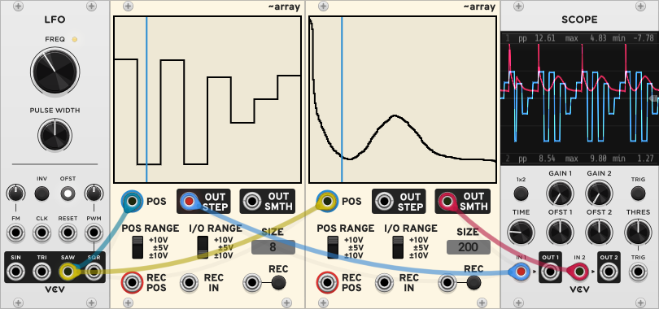
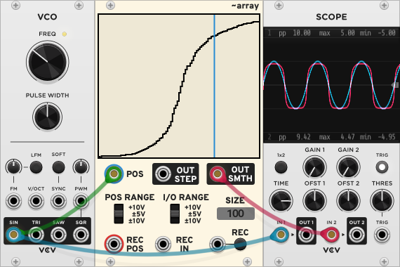
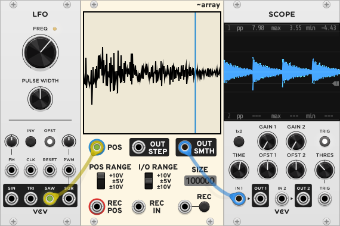
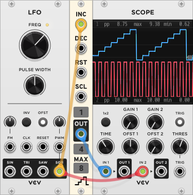

# PdArray

PdArray is a plugin for the [VCV Rack](https://vcvrack.com/) virtual modular
synthesizer that allows creating custom envelopes, much like the `array` object
in [Pure Data](https://puredata.info/). You can enter values into the array
either by manually drawing, recording an input, or loading a sample. A CV input
controls the position of a cursor for reading out the array values. There are
two outputs: one will output the stepped values of the array directly (useful
for e.g. sequencing), and the other will output smooth interpolated values,
using the same interpolation algorithm as the `tabread4~` object in Pd.

PdArray can be used as an envelope generator, sequencer, sample player,
waveshaper or in a number of other weird and interesting ways.

The plugin also contains two small companion modules called Miniramp and
Ministep.  Miniramp can be used to to easily record or read out the array
sequentially, while Ministep helps with stepping through the array using a
clock, like a traditional sequencer.

## Array
Array is the main module of the PdArray plugin. This is its interface:

On the top row, you will find one input and two outputs. The POS input takes a
CV (or audio) signal which determines which value from the array to read, or
play back. The value at this position will then be output to OUT STEP and OUT
SMTH. The OUT STEP output contains the array values directly, while OUT SMTH
will output smoothed (interpolated) values.

The POS input supports polyphony. When a polyphonic cable is inserted into POS,
each voltage in the input will have its own cursor, and the OUT STEP and OUT
SMTH outputs will output polyphonic signals at each of the cursors.

The POS RANGE switch can be used to select the expected range of the POS input;
use +10V for e.g. unipolar LFO's and Miniramp, +-5V for bipolar LFO's and audio
signals.  Similarly, the I/O RANGE switch selects the range of values that you
wish to record and what the outputs will have. Setting the switch to +10V means
that the top edge of the visual representation of the array corresponds to +10V
and the bottom edge to 0V, while for +-5 and 10 the top and bottom edges of the
array are plus and minus 5 or 10 volts, respectively, and the middle
corresponds to 0V.

The SIZE screen displays the current number of elements in the array. You can
click on the screen to type a value up to 999999. If the array has more
elements than there are pixels on the display, drawing will affect multiple
array values at once.  The array values are saved in the patch file, so be
aware that patch files may become large if you have a large SIZE.

The bottom row contains CV inputs related to recording. The REC POS dictates
the position in the array where a recorded value will be written. Its expected
values are set using POS RANGE, just as for the playback POS. Input the signal
or values you want to record to the REC IN input, and click and hold the REC
LED or send a gate voltage to the REC input to record. Recording is only
monophonic.

Right-clicking on the module will open up some additional options, like
initializing the array, loading an audio file and setting the interpolation
mode.

### Drawing sequences or envelopes

The most basic usage of PdArray is to just draw a sequence of values or an
envelope with your mouse. Increase the SIZE to get a smoother array, although
you can get reasonably smooth envelopes even with a small SIZE if you use the
OUT SMTH output.

### Recording

Input a ramp or LFO signal to REC POS, send audio or CV (or anything really) to
REC IN, send a high gate to the REC input or click on the LED, and watch how
the input signal gets imprinted to the array in real time.

### Using PdArray as a waveshaper

PdArray can be easily used as a waveshaper by either drawing or recording a
waveshaper curve, and then sending an audio signal to the POS CV input, with a
POS RANGE of +-5V for typical audio signals. You can even re-record the curve
while the audio is playing for interesting effects!

### Loading and playing samples

By right-clicking on the Array module, you can load a wav sample file. The
number in the right-click menu shows the duration of the loaded sample at the
current sample rate. After selecting a file, the array will contain the first N
samples of the audio file, where N is the array size shown in the SIZE display.
The audio file will always be loaded from the beginning, so you will need to
trim your file with an external audio editing application if you wish to load
it starting from another position.

Playing back a sample works the same way as reading the array in general: input
a voltage to POS and connect the outputs to wherever.

After loading a sample, drawing will be locked (but you can unlock it from the
right-click menu).

## Miniramp

Miniramp is a small envelope generator that outputs a linear ramp from 0 to 10V
in a certain time. The duration of the ramp is shown on the bottom. The large
knob controls the base duration, either with linear or logarithmic scaling as
selected by the LIN/LOG switch. You can control the ramp duration / speed with
the CV input and CV amount knob. When you send a trigger to TRG IN, RAMP will
output the ramp, and the GATE output will output 10V while the ramp is in
progress, useful for e.g. the REC input of Array.

## Ministep

Ministep is a counter that can be used to step through an Array, like a
sequencer. The current value of the counter is shown on the middle display.
Sending a trigger to INC increments the counter, while a trigger to DEC
decrements it. The RST input resets the counter to 1. You can click on the MAX
display to change the maximum number of steps, up to 999.

The SCL CV input controls how much the counter increments/decrements on each
step. The step size is shown on the top display. When no cable is connected,
the step size is 1, but note that connecting a 0V signal sets the step size to
zero (you can also input negative values!). By default, setting SCL to 10 volts
makes the step size equal to MAX, but the behavior can be changed to make one
volt correspond to one step from the "scale mode" right-click menu. The step
size is always rounded towards zero.

By default, the output will be 10V divided into N steps, where N is the maximum
number. This way, it is easy to use with an Array whose SIZE is set equal to N.
However, from the "output mode" right-click menu, you can also configure
Ministep to output the step number directly as a voltage. In this mode, step 1
outputs 0V, step 2 outputs 1V and so on.

For polyphonic signals, there will be one counter per channel. Sending a
monophonic trigger to the reset input resets all channels, while a polyphonic
trigger can be used to reset individual channels. Similarly, a monophonic CV
connected to SCL scales the step size of all channels, while a polyphonic
signal affects each channel separately.

By detecting the falling edge of the output or applying a threshold to the
output value near zero, you can use Ministep as a clock divider! Fiddling with
SCL can also lead to interesting results. A step size that has few divisors can
be used to generate somewhat random voltages, or triggering the increment at
audio rate and adjusting the step size can create interesting harmonics.

## Contributing
If you have suggestions or feedback or find a bug or whatever, feel free to open
an issue or a pull request in this repository!

Building the modules follows the [standard procedure](https://vcvrack.com/manual/PluginDevelopmentTutorial.html#creating-the-template-plugin):
`RACK_DIR=/path/to/Rack_SDK/ make install`.

## Licenses
The source code and panel artwork are licensed under the MIT license (see
[LICENSE](LICENSE.txt)). This repo also contains the fonts used for creating
the panels: Overpass is licensed under the Open Font License (see
[here](res/fonts/OFL.txt)) and Roboto is licensed under the Apache 2 License
(see [here](res/fonts/APACHE2.txt)).
